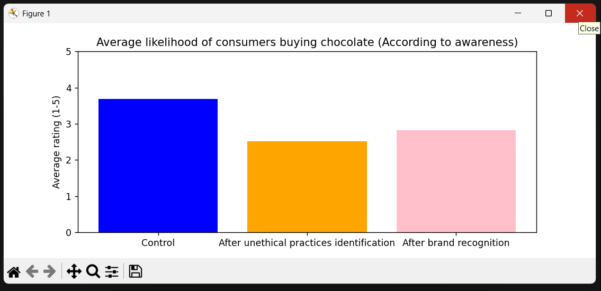
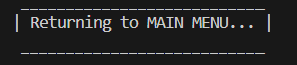
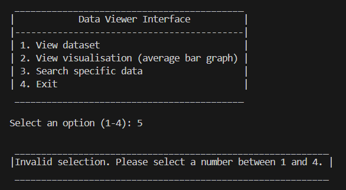

# 9CT-Task-3 : THE CHOCOLATE TEST
## Purpose
This user interface was made based on data collected from Gosford High School students in a survey (**https://docs.google.com/forms/d/1qK7AgJ3ELWjKxiN2J_aqGqjO82X-CKDoRDy08JL1He8**)

The data revolves around exploring consumers' willingness to purchase chocolate(and therefore other like products) from a specific popular company when made aware of unethical company practices including issues like child slavery, worker exploitment and illegal cocoa farming.

This research ultimately aims to reveal if being informed really does positively influence a consumer's decision-making and if brand recognition can hinder such actions.
## How to Use
### Main Menu
When starting the user interface, this will pop up on your screen.

 

The contents inside the box are your options that you can select. When you know what you want to pick, there will be a line below such as 'Select an option (1-4): ' where you can type which action you want to take.

**Each line will have in brackets what options you can type.** In this example, you can type the options 1, 2, 3, 4.

---
### Visualisation
When you are finished looking at the visualisation/graph, you must close it to continue using the user interface.

After it has been closed, you should see this message:

---
### Error Message

If you type an unavailable option, an error message will appear re-stating what options you can take, and a menu will re-appear with your options.

